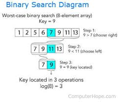

# Binary Search 
## Idea
The idea of binary search is to use the information that the array is sorted and reduce the time complexity to O(Log n).
## Pre-Requisites
 --> Data structure must be sorted in the same order as the one assumed by the binary search algorithm.
 --> Data structure must be sorted (weak-ordered) for any search other than linear to work.

 ## Time complexity
  T(n) = T(n/2) + c
 ## Auxiliary Space
 O(1) in case of iterative implementation. In case of recursive implementation, O(Logn) recursion call stack space.

## Explaination

Search a sorted array by repeatedly dividing the search interval in half. Begin with an interval covering the whole array. If the value of the search key is less than the item in the middle of the interval, narrow the interval to the lower half. Otherwise narrow it to the upper half. Repeatedly check until the value is found or the interval is empty.
 ## Steps to perform binary search
 ### 1.Compare x with the middle element.
 ### 2.If x matches with middle element, we return the mid index.
 ### 3.Else If x is greater than the mid element, then x can only lie in right half subarray after the mid element. So we recur for right half.
 ### 4.Else (x is smaller) recur for the left half.
 ## Psuedo Code
    def binarySearch (arr, l, r, x): 
  
    # Check base case 
    if r >= l: 
  
        mid = l + (r - l) // 2
  
        # If element is present at the middle itself 
        if arr[mid] == x: 
            return mid 
          
        # If element is smaller than mid, then it  
        # can only be present in left subarray 
        elif arr[mid] > x: 
            return binarySearch(arr, l, mid-1, x) 
  
        # Else the element can only be present  
        # in right subarray 
        else: 
            return binarySearch(arr, mid + 1, r, x) 
  
    else: 
        # Element is not present in the array 
        return -1
  
 

